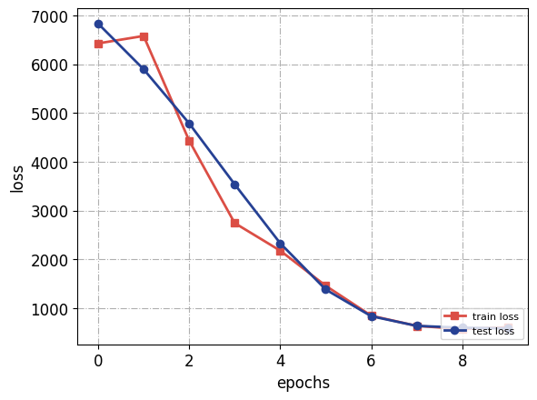
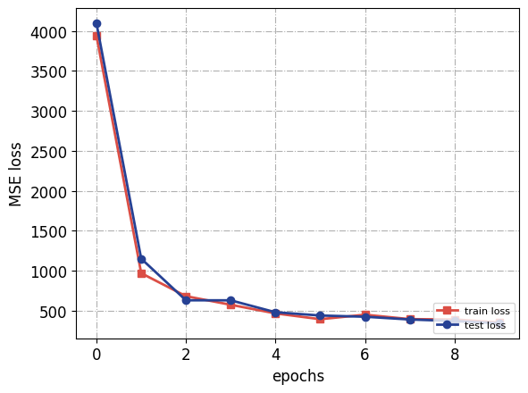
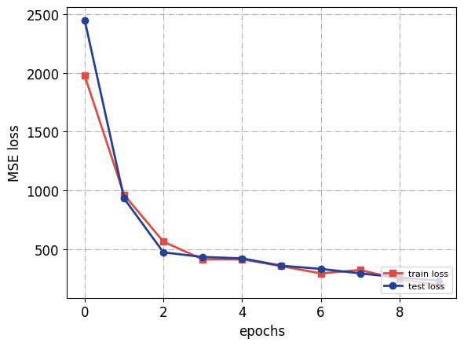
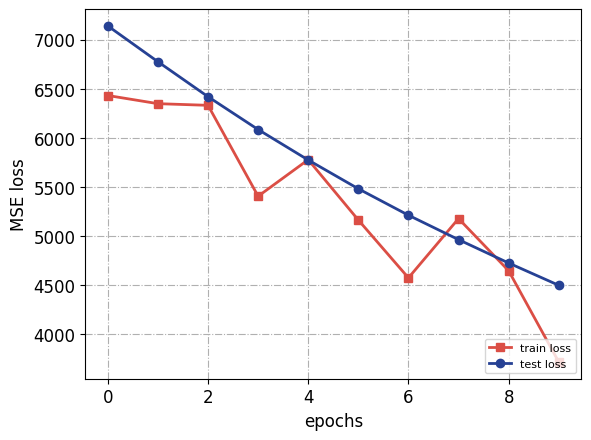
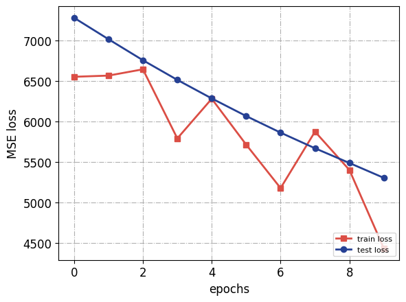

# 上机实验一：基于前馈神经网络的回归任务设计

## 网络设计

设计了隐藏层尺寸分别为[32]，[64, 32]，[128, 64, 32] 三种前馈神经网络，激活函数分别选择Relu，cos和sigmoid三种函数进行实验。

## 其他训练参数

使用Adam优化器（参数为pytorch默认设置），均方误差作为损失函数；使用批量梯度下降，batch size设为500；学习率保持0.01不变；epoch数为10。

## 实验结果与分析

### 不同隐藏层的对比实验

实验中激活函数均为Relu

隐藏层尺寸为[32]的网络loss曲线图：



最终测试集loss：581.1506

隐藏层尺寸为[64, 32]的网络loss曲线图：



最终测试集loss：343.1129

隐藏层尺寸为[128, 64, 32]的网络loss曲线图：



最终测试集loss：234.4953

#### 分析

可以看到，对于简单的独立同分布的函数拟合任务，网络基本不存在过拟合现象，在同样的训练参数设置下，更复杂的神经网络在有限的训练iteration下拟合函数的能力更强。

### 不同激活函数的对比实验

实验中网络隐藏层尺寸均为[128, 64, 32]

Relu激活函数的loss曲线图：


最终测试集loss：234.4953

cos激活函数的loss曲线图：



最终测试集loss：4498.3569

sigmoid激活函数的loss曲线图：



最终测试集loss：5303.4580

#### 分析

可以看到，在Relu，cos和sigmoid三种激活函数中，Relu激活函数在这一函数拟合任务上的表现最好，而其余两种激活函数的训练效率都要低很多。

## 实验代码

```Python
import random
import os

import torch
import argparse
import numpy as np
from torch.utils.data import random_split
from torch.utils.data import DataLoader
import matplotlib as mpl
import matplotlib.pyplot as plt

class Generated_Dataset(torch.utils.data.Dataset):

    def __init__(self, device):
        x = np.random.uniform(-10, 10, 5000)
        y = np.random.uniform(-10, 10, 5000)
        f = x*x + x*y + y*y

        x = torch.tensor(x, dtype=torch.float32).reshape(-1, 1)
        y = torch.tensor(y, dtype=torch.float32).reshape(-1, 1)
        self.data = torch.cat([x, y], dim=1).to(device)
        self.label = torch.tensor(f, dtype=torch.float32).reshape(-1, 1).to(device)
        

    def __getitem__(self, idx):
        data = self.data[idx]
        label = self.label[idx]
        return data, label

    def __len__(self):
        return self.label.size(0)

class Net(torch.nn.Module):
    def __init__(self, hidden_layer_sizes):
        super(Net, self).__init__()
        self.hidden_layers = torch.nn.ModuleList()
        for i in range(len(hidden_layer_sizes)):
            if i == 0:
                self.hidden_layers.append(
                    torch.nn.Linear(2, hidden_layer_sizes[i]))
            else:
                self.hidden_layers.append(torch.nn.Linear(
                    hidden_layer_sizes[i-1], hidden_layer_sizes[i]))
        self.output_layer = torch.nn.Linear(hidden_layer_sizes[-1], 1)

    def forward(self, x):
        for layer in self.hidden_layers:
            x = torch.relu(layer(x))
        x = self.output_layer(x)
        return x


def train(net, train_loader, test_loader, loss_func, optimizer, device):
    train_loss_list = []
    test_loss_list = []

    for epoch in range(OPTS.num_epochs):
        for x, y in train_loader:
            net.train()
            prediction = net(x)
            loss = loss_func(prediction, y)
            optimizer.zero_grad()
            loss.backward()
            optimizer.step()

        if epoch % OPTS.print_freq == 0:
            print('epoch: {}, loss: {:.4f}'.format(epoch, loss.data))
        train_loss_list.append(loss.data.cpu())

        test_loss = test(net, test_loader, loss_func, device=device)
        test_loss_list.append(test_loss.data.cpu())

    return train_loss_list, test_loss_list

def test(net, test_loader, loss_func, device):
    net.eval()
    with torch.no_grad():
        
        for x, y in test_loader:
            test_prediction = net(x)
            test_loss = loss_func(test_prediction, y)
            

    print('test loss: {:.4f}'.format(test_loss.data))
    return test_loss


def parse_args():
    parser = argparse.ArgumentParser()
    parser.add_argument('--seed_value', type=int, default=123456)
    parser.add_argument('--learning-rate', '-r', type=float, default=1e-2)
    parser.add_argument('--num-epochs', '-T', type=int, default=10)
    parser.add_argument('--batch-size', '-b', type=int, default=500)
    parser.add_argument(
        '--print-freq',
        type=int,
        default=1,
        help='frequency to print info (per epoches)'
    )
    return parser.parse_args()


def main():

    # Set seed
    random.seed(OPTS.seed_value)
    np.random.seed(OPTS.seed_value)
    torch.manual_seed(OPTS.seed_value)
    os.environ['PYTHONHASHSEED'] = str(OPTS.seed_value)
    torch.cuda.manual_seed(OPTS.seed_value)
    torch.backends.cudnn.deterministic = True
    torch.backends.cudnn.benchmark = False

    device = torch.device(
        'cuda') if torch.cuda.is_available() else torch.device('cpu')

    dataset = Generated_Dataset(device)

    train_data, test_data = random_split(
        dataset=dataset,
        lengths=[int(len(dataset)*9/10), int(len(dataset)/10)],
        generator=torch.Generator().manual_seed(OPTS.seed_value)
    )

    train_loader = DataLoader(dataset=train_data, batch_size=OPTS.batch_size, shuffle=True, num_workers=0, drop_last=False)
    test_loader = DataLoader(dataset=test_data, batch_size=len(test_data), shuffle=False, num_workers=0, drop_last=False)

    hidden_layer_sizes = [128, 64, 32]  
    net = Net(hidden_layer_sizes).to(device)

    optimizer = torch.optim.Adam(net.parameters(), lr=OPTS.learning_rate)
    loss_func = torch.nn.MSELoss()

    train_loss_list, test_loss_list = train(
        net, train_loader, test_loader, loss_func, optimizer, device)

    color1 = '#db4e45'
    color2 = '#264194'
    color3 = '#4ba9ad'
    color4 = '#eda841'

    TICKSIZE = 12
    LABELSIZE = 12
    LEGANDSIZE = 8

    plt.plot(list(range(OPTS.num_epochs)), np.array(train_loss_list), color=color1,
             linestyle='-', marker='s', ms=6.0, label='train loss', linewidth=2)
    plt.plot(list(range(OPTS.num_epochs)), np.array(test_loss_list), color=color2,
             linestyle='-', marker='o', ms=6.0, label='test loss', linewidth=2)

    plt.xticks(fontsize=TICKSIZE)
    plt.yticks(fontsize=TICKSIZE)

    plt.legend(fontsize=LEGANDSIZE, loc='lower right')  # 显示图例

    plt.grid(linestyle='-.')

    plt.xlabel('epochs', fontsize=LABELSIZE)
    plt.ylabel('MSE loss', fontsize=LABELSIZE)
    plt.show()
    plt.savefig("loss_pic.png", bbox_inches='tight')


if __name__ == '__main__':
    OPTS = parse_args()
    main()

```

