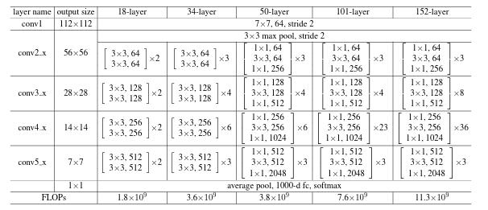
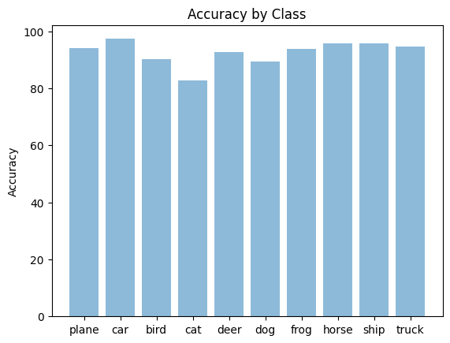
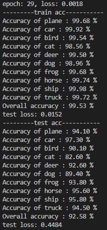

# 上机实验二：基于卷积神经网络的CIFAR-10数据集分类

## 网络设计

选择ResNet[1]，由于本实验仅为一次简单的上机实验，因此我并没有选择resnet原论文在cifar10上使用的一些更小的模型，而是直接选用Resnet18的架构

## 训练策略

由于本实验仅为一次简单的上机实验，因此我并没有选择resnet原论文的训练策略，而是选择了自己在其他研究项目常用的设置，并大幅度缩减了训练epochs数（原论文的15%）

* 使用cifar10上普遍被采用的随机翻转与裁剪作为数据增强
* 优化器使用Adam，其超参数为pytorch默认，未使用权重惩罚
* 学习率schedule：在训练整体epochs数的最后10个epochs使用余弦函数曲线使学习率从初始学习率衰减至0
* 初始学习率：0.01
* num of epochs: 30
* 训练batch size: 512

## 实验结果与分析

最终测试集上准确率如上图所示，由于本次实验内容较为简单，我并没有反复调整训练策略，仅训练一次后直接汇报了结果，可以看到最终的训练集整体准确率为92.58%，证明模型能够较为成功地在cifar10上进行分类。值得注意的是在cifar10上的动物上，分类准确率明显低于其他工业制品的类别。

## 实验建议

如果更仔细地调整其他训练超参、增加训练时间，或者甚至简单地照抄[1]对于cifar10数据集采用的简化版resnet与调整好的超参，取得更高的准确率并不困难，但我并不认为这样做有更多的意义，也并不建议将90%以上的更高准确率作为刷分标准。

[1] He, Kaiming, et al. "Deep Residual Learning for Image Recognition."