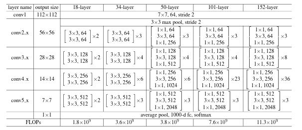
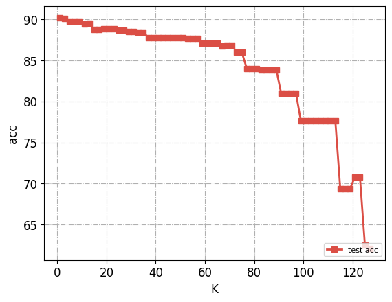
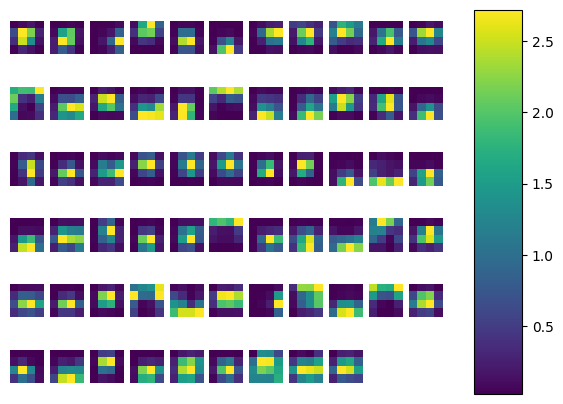

# 上机实验三：基于剪枝算法的深度神经网络压缩

## 网络设计

同上机实验二，选择ResNet[1]中Resnet18的架构。



## 实验结果与分析

### 模型剪枝的选择

由于我选用的模型是Resnet-18，当对某一block的最后一层卷积层做完全剪枝（权重全部置为零）时，网络即会将上一层block的输出原样输出。而通过实验发现，由于模型参数量对于cifar10数据集过大，resnet18的最后四个Basic block（即通道数为256的两个和512的两个）已经基本**完全退化**。例如，若对整个网络的最后一层卷积层完全剪枝，则神经网络的准确率只下降**0.6%**；而对网络倒数第三个Basic block的最后一层卷积层（整个网络的倒数第五个卷积层）完全剪枝，则网络准确率只下降**2.74%**；而对网络倒数第五个Basic block的最后一层卷积层（整个网络的倒数第九个卷积层）做完全剪枝，则网络准确率会下降至62.12%；故为了使剪枝对模型准确率的影响更加明显，选择使用对网络倒数第五个Basic block的最后一层卷积层（整个网络的倒数第九个卷积层）进行剪枝。

### 剪枝效果

该卷积层的输出共128个通道，对于不同的K（剪枝的通道数目），模型在测试集上的准确率 acc ( % ) 变化如下：



可以看到，当剪枝通道数较少时，网络准确率下滑速度较慢，但随着剪枝通道数的增加，准确率下降速度逐渐加快。

### 特征图可视化

基于前述分析，Resnet18的最后一层卷积层已经基本完全退化，若按照实验要求画出最后一层卷积层（剪枝前）在整个测试数据集上的平均输出特征图，则基本不会得到任何结果，因此我选择了对在累加了前一个Basic block的输出后网络的最终输出进行可视化。

由于输出共有512个通道，整体输出为512x4x4。为了便于展示，选择了输出最高的前64个通道的平均输出特征图。从左到右，从上到下，通道的激活值总和逐个递增。可以看到，越后的特征图的激活区域（高亮区域）越多。




## 实验代码

```python
import random
import os

import torch
import argparse
import numpy as np
from torch.utils.data import random_split
from torch.utils.data import DataLoader
import torch.nn.functional as F
import torch.optim as optim
import torch.nn as nn
import matplotlib as mpl
import matplotlib.pyplot as plt
import torchvision.datasets as datasets
import torchvision.transforms as transforms

import os

os.environ['CUDA_LAUNCH_BLOCKING'] = '1'

class BasicBlock(nn.Module):
    expansion = 1

    def __init__(self, in_planes, planes, stride=1):
        super(BasicBlock, self).__init__()
        self.conv1 = nn.Conv2d(in_planes, planes, kernel_size=3, stride=stride, padding=1, bias=False)
        self.bn1 = nn.BatchNorm2d(planes)
        self.conv2 = nn.Conv2d(planes, planes, kernel_size=3, stride=1, padding=1, bias=False)
        self.bn2 = nn.BatchNorm2d(planes)

        self.shortcut = nn.Sequential()
        if stride != 1 or in_planes != self.expansion*planes:
            self.shortcut = nn.Sequential(
                nn.Conv2d(in_planes, self.expansion*planes, kernel_size=1, stride=stride, bias=False),
                nn.BatchNorm2d(self.expansion*planes)
            )

    def forward(self, x):
        out = F.relu(self.bn1(self.conv1(x)))
        out = self.bn2(self.conv2(out))
        out += self.shortcut(x)
        out = F.relu(out)
        return out


class ResNet(nn.Module):
    def __init__(self, block, num_blocks, num_classes=10):
        super(ResNet, self).__init__()
        self.in_planes = 64

        self.conv1 = nn.Conv2d(3, 64, kernel_size=3, stride=1, padding=1, bias=False)
        self.bn1 = nn.BatchNorm2d(64)
        self.layer1 = self._make_layer(block, 64, num_blocks[0], stride=1)
        self.layer2 = self._make_layer(block, 128, num_blocks[1], stride=2)
        self.layer3 = self._make_layer(block, 256, num_blocks[2], stride=2)
        self.layer4 = self._make_layer(block, 512, num_blocks[3], stride=2)
        self.linear = nn.Linear(512*block.expansion, num_classes)

    def _make_layer(self, block, planes, num_blocks, stride):
        strides = [stride] + [1]*(num_blocks-1)
        layers = []
        for stride in strides:
            layers.append(block(self.in_planes, planes, stride))
            self.in_planes = planes * block.expansion
        return nn.Sequential(*layers)

    def forward(self, x):
        out = F.relu(self.bn1(self.conv1(x)))
        out = self.layer1(out)
        out = self.layer2(out)
        out = self.layer3(out)
        out = self.layer4(out)
        out = F.avg_pool2d(out, 4)
        out = out.view(out.size(0), -1)
        out = self.linear(out)

        return out
    

def ResNet18():
    return ResNet(BasicBlock, [2,2,2,2])


def plot_class_acc(correct, total):
    class_names = ['plane', 'car', 'bird', 'cat', 'deer', 'dog', 'frog', 'horse', 'ship', 'truck']
    acc_list = []
    # fig, ax = plt.subplots()
    x_pos = np.arange(10)
    for i in range(10):
        acc = 100.0 * correct[i] / total[i]
        acc_list.append(acc)
        print('Accuracy of %s : %.2f %%' % (class_names[i], acc))
    total_correct = sum(correct)
    total_samples = sum(total)
    acc = 100.0 * total_correct / total_samples
    print('Overall accuracy : %.2f %%' % (acc))
    # ax.bar(x_pos, acc_list, align='center', alpha=0.5)
    # ax.set_xticks(x_pos)
    # ax.set_xticklabels(class_names)
    # ax.set_ylabel('Accuracy')
    # ax.set_title('Accuracy by Class')
    # plt.show()
    # plt.savefig("class_acc_pic.png", bbox_inches='tight')
    return acc
    

def prune(net, testloader, K, device):
    net.eval()


    activations = []
    def hook(module, input, output):
        activations.append(output.detach().mean(dim=[0, 2, 3]).unsqueeze(0))

    # final_conv_layer = net.layer3[1].conv2
    # final_short_cut = net.layer3
    # print(final_short_cut)
    # exit()

    handle = net.layer2[1].conv2.register_forward_hook(hook)
    with torch.no_grad():
        for i, (inputs, labels) in enumerate(testloader):
            inputs, labels = inputs.to(device), labels.to(device)
            outputs = net(inputs)

    # select neruon to prune
    activation = torch.cat(activations, dim=0).mean(dim=0).squeeze(0)
    indices = activation.argsort()[:K]


    with torch.no_grad():
        net.layer2[1].conv2.weight.data[:, indices, :, :] = 0


    correct = 0
    total = 0
    weight_size = 0
    with torch.no_grad():
        for i, (inputs, labels) in enumerate(testloader):
            inputs, labels = inputs.to(device), labels.to(device)
            outputs = net(inputs)
            _, predicted = torch.max(outputs.data, 1)
            total += labels.size(0)
            correct += (predicted == labels).sum().item()
        # weight_size = final_conv_layer.weight.nelement() + final_conv_layer.bias.nelement()
        weight_size = net.layer2[1].conv2.weight.nelement()


    return 100 * correct / total, weight_size

def train(net, train_loader, test_loader, loss_func, optimizer, device, full_train_epochs):
    train_loss_list = []
    train_acc_list = []
    test_loss_list = []
    test_acc_list = []
    lr_scheduler = torch.optim.lr_scheduler.CosineAnnealingLR(
        optimizer, T_max=full_train_epochs, verbose=True)

    for epoch in range(OPTS.num_epochs):
        if epoch > OPTS.num_epochs - full_train_epochs:
            lr_scheduler.step()
        net.train()
        for x, y in train_loader:
            x = x.to(device)
            y = y.to(device)
            
            prediction = net(x)
            loss = loss_func(prediction, y)
            optimizer.zero_grad()
            loss.backward()
            optimizer.step()

        if epoch % OPTS.print_freq == 0:
            print('epoch: {}, loss: {:.4f}'.format(epoch, loss.data))
            train_loss_list.append(loss.data.cpu())
            print('---------train acc-----------')
            train_loss, train_acc = test(net, train_loader, loss_func, device=device)
            train_acc_list.append(train_acc)
            print('---------test acc-----------')
            test_loss, test_acc = test(net, test_loader, loss_func, device=device)
            test_loss_list.append(test_loss.data.cpu())
            test_acc_list.append(test_acc)

    return train_acc_list, test_acc_list

def test(net, test_loader, loss_func, device):
    net.eval()
    correct = [0] * 10
    total = [0] * 10
    with torch.no_grad():
        for i, (inputs, labels) in enumerate(test_loader):
            inputs, labels = inputs.to(device), labels.to(device)
            outputs = net(inputs)
            test_loss = loss_func(outputs, labels)
            _, predicted = torch.max(outputs.data, 1)
            for j in range(len(labels)):
                label = labels[j]
                correct[label] += (predicted[j] == label).item()
                total[label] += 1
           
        acc = plot_class_acc(correct, total)
            

    print('test loss: {:.4f}'.format(test_loss.data))
    return test_loss, acc


def parse_args():
    parser = argparse.ArgumentParser()
    parser.add_argument('--seed_value', type=int, default=123456)
    parser.add_argument('--learning-rate', '-r', type=float, default=1e-2)
    parser.add_argument('--num-epochs', '-T', type=int, default=30)
    parser.add_argument('--batch-size', '-b', type=int, default=512)
    parser.add_argument(
        '--print-freq',
        type=int,
        default=1,
        help='frequency to print info (per epoches)'
    )
    parser.add_argument(
        '--full-train-epochs',
        type=int,
        default=15,
        help='If specified use lr schedule for these epochs at the end'
    )
    parser.add_argument('--load-model',
                        action='store_true',
                        help='If load model')
    return parser.parse_args()


def main():

    # Set seed
    random.seed(OPTS.seed_value)
    np.random.seed(OPTS.seed_value)
    torch.manual_seed(OPTS.seed_value)
    os.environ['PYTHONHASHSEED'] = str(OPTS.seed_value)
    torch.cuda.manual_seed(OPTS.seed_value)
    torch.backends.cudnn.deterministic = True
    torch.backends.cudnn.benchmark = False

    device = torch.device(
        'cuda') if torch.cuda.is_available() else torch.device('cpu')

    train_transform = transforms.Compose([
        transforms.RandomHorizontalFlip(),
        transforms.RandomCrop(32, padding=4),
        transforms.ToTensor(),
        transforms.Normalize((0.5, 0.5, 0.5), (0.5, 0.5, 0.5)),
    ])
    test_transform = transforms.Compose([
        transforms.ToTensor(),
        transforms.Normalize((0.5, 0.5, 0.5), (0.5, 0.5, 0.5)),
    ])
    train_dataset = datasets.CIFAR10(root='./data/cifar10', train=True, download=True, transform=train_transform)
    test_dataset = datasets.CIFAR10(root='./data/cifar10', train=False, download=True, transform=test_transform)
    train_loader = torch.utils.data.DataLoader(train_dataset, batch_size=OPTS.batch_size, shuffle=True)
    test_loader = torch.utils.data.DataLoader(test_dataset, batch_size=OPTS.batch_size, shuffle=False)

    net = ResNet18().to(device)

    loss_func = nn.CrossEntropyLoss().to(device)
    optimizer = torch.optim.Adam(net.parameters(), lr=OPTS.learning_rate, weight_decay=1e-5)


    if not OPTS.load_model:
        train_loss_list, test_loss_list = train(net, train_loader, test_loader, loss_func, optimizer, device, full_train_epochs = OPTS.full_train_epochs)
        torch.save(net.state_dict(), 'resnet18.pt')
    else:
        net.load_state_dict(torch.load("resnet18.pt"))
    

    K_values = list(range(1, 128, 2))
    pruning_accuracy = []
    pruning_weight_size = []

    #prune
    for K in K_values:
        net.load_state_dict(torch.load("resnet18.pt"))
        accuracy, weight_size = prune(net, test_loader, K, device)
        pruning_accuracy.append(accuracy)
        pruning_weight_size.append(K)
        print(f'K={K}, accuracy={accuracy}, weight size={weight_size}')


    color1 = '#db4e45'
    color2 = '#264194'
    color3 = '#4ba9ad'
    color4 = '#eda841'

    TICKSIZE = 12
    LABELSIZE = 12
    LEGANDSIZE = 8

    plt.plot(np.array(pruning_weight_size), np.array(pruning_accuracy), color=color1,
             linestyle='-', marker='s', ms=6.0, label='test acc', linewidth=2)
    # plt.plot(list(range(OPTS.num_epochs)), np.array(test_loss_list), color=color2,
    #          linestyle='-', marker='o', ms=6.0, label='test loss', linewidth=2)

    plt.xticks(fontsize=TICKSIZE)
    plt.yticks(fontsize=TICKSIZE)

    plt.legend(fontsize=LEGANDSIZE, loc='lower right')  # 显示图例

    plt.grid(linestyle='-.')

    plt.xlabel('K', fontsize=LABELSIZE)
    plt.ylabel('acc', fontsize=LABELSIZE)
    plt.show()
    plt.savefig("loss_pic.png", bbox_inches='tight')

    

    # draw featuremap
    net.eval()
    net.load_state_dict(torch.load("resnet18.pt"))
    activations = []
    def hook(module, input, output):
        activations.append(output.detach().mean(dim=[0]).unsqueeze(0))
    handle = net.layer4.register_forward_hook(hook)
    with torch.no_grad():
        for i, (inputs, labels) in enumerate(test_loader):
            inputs, labels = inputs.to(device), labels.to(device)
            outputs = net(inputs)

    # select neruon to prune
    activation = torch.cat(activations, dim=0).mean(dim=0).squeeze(0)
    activation_mean = torch.cat(activations, dim=0).mean(dim=[0, 2, 3]).squeeze(0)
    indices = activation_mean.argsort()[-64:]

    # activation = activations[indices]
    # result = activation[indices, :, :]
    
    for i in range(64):
        plt.subplot(6,11,i+1)
        plt.imshow(activation[indices[i], :, :].cpu())
        plt.axis('off')
    plt.subplots_adjust(bottom=0.1, right=0.8, top=0.9)
    cax = plt.axes([0.85, 0.1, 0.075, 0.8])
    plt.colorbar(cax=cax)
    
    plt.show()
    
    plt.savefig("feature_map.png", bbox_inches='tight')


if __name__ == '__main__':
    OPTS = parse_args()
    main()

```

