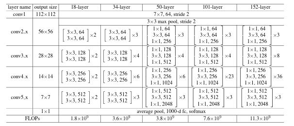
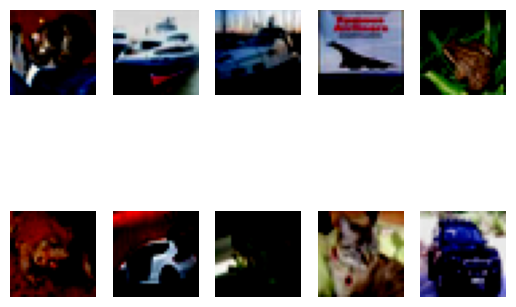

# 上机实验四：深度神经网络后门攻击

## 网络设计

同上机实验二，选择ResNet[1]中Resnet18的架构。



由于本次实验需要多次重新训练神经网络，故我将训练epochs数从实验二的30减少到了15，其余超参与训练策略保持不变。

## 后门攻击设计

自己设计了一种后门trigger，将一张网络人物图片降采样为8x8的大小，如下图所示，其黑色周边区域为透明部分（像素值为0/255）


再将该trigger与所有干净样本右下角8x8的区域融合，其中，中心4x4的区域以$\beta_2$的比例与干净样本融合，其余区域以$\beta_1$的比例与干净样本融合。融合方式与常见的后门攻击方式相同，在右下角8x8的区域中心4x4的区域，攻击后的样本${img}_{atk2} $像素值为

$${img}_{atk2} = \beta_2*img_{backdoor} + (1-\beta_2)*img_{clean}$$

而对于这8x8的区域中的其他区域，攻击后的样本${img}_{atk1} $像素值为

${img}_{atk1} = \beta_1*img_{backdoor} + (1-\beta_1)*img_{clean}$

其中，$img_{backdoor}$为后门trigger，$img_{clean}$为原始干净样本，我们有$\beta_2>\beta_1$

攻击前的一批干净样本如图（测试集的前十张图片）：



植入后门后的样本如图（第四张图片为airplane， 没有植入后门）：


可以看到我们的trigger基本无法被肉眼辨识，仅能从极个别图片上看到右下角的一个小点（例如第二张图片）

## 实验结果与分析

根据R（污染样本占比）的不同，攻击成功率与模型正常分类准确率变化如下图所示。可以看到，一但我们污染超过0.5%的样本，后门trigger的攻击效果就能达到一个非常高的水平（＞80%）


## 实验代码

```python
import random
import os

import torch
import argparse
import numpy as np
from torch.utils.data import random_split
from torch.utils.data import DataLoader
import torch.nn.functional as F
import torch.optim as optim
import torch.nn as nn
import matplotlib as mpl
import matplotlib.pyplot as plt
import torchvision.datasets as datasets
import torchvision.transforms as transforms
import cv2 as cv


class BasicBlock(nn.Module):
    expansion = 1

    def __init__(self, in_planes, planes, stride=1):
        super(BasicBlock, self).__init__()
        self.conv1 = nn.Conv2d(in_planes, planes, kernel_size=3, stride=stride, padding=1, bias=False)
        self.bn1 = nn.BatchNorm2d(planes)
        self.conv2 = nn.Conv2d(planes, planes, kernel_size=3, stride=1, padding=1, bias=False)
        self.bn2 = nn.BatchNorm2d(planes)

        self.shortcut = nn.Sequential()
        if stride != 1 or in_planes != self.expansion*planes:
            self.shortcut = nn.Sequential(
                nn.Conv2d(in_planes, self.expansion*planes, kernel_size=1, stride=stride, bias=False),
                nn.BatchNorm2d(self.expansion*planes)
            )

    def forward(self, x):
        out = F.relu(self.bn1(self.conv1(x)))
        out = self.bn2(self.conv2(out))
        out += self.shortcut(x)
        out = F.relu(out)
        return out
    
    def visualize(self, x):
        out = F.relu(self.bn1(self.conv1(x)))
        out = self.bn2(self.conv2(out))
        out += self.shortcut(x)
        return out


class ResNet(nn.Module):
    def __init__(self, block, num_blocks, num_classes=10):
        super(ResNet, self).__init__()
        self.in_planes = 64

        self.conv1 = nn.Conv2d(3, 64, kernel_size=3, stride=1, padding=1, bias=False)
        self.bn1 = nn.BatchNorm2d(64)
        self.layer1 = self._make_layer(block, 64, num_blocks[0], stride=1)
        self.layer2 = self._make_layer(block, 128, num_blocks[1], stride=2)
        self.layer3 = self._make_layer(block, 256, num_blocks[2], stride=2)
        self.layer4 = self._make_layer(block, 512, num_blocks[3], stride=2)
        self.linear = nn.Linear(512*block.expansion, num_classes)

    def _make_layer(self, block, planes, num_blocks, stride):
        strides = [stride] + [1]*(num_blocks-1)
        layers = []
        for stride in strides:
            layers.append(block(self.in_planes, planes, stride))
            self.in_planes = planes * block.expansion
        return nn.Sequential(*layers)

    def forward(self, x):
        out = F.relu(self.bn1(self.conv1(x)))
        out = self.layer1(out)
        out = self.layer2(out)
        out = self.layer3(out)
        out = self.layer4(out)
        out = F.avg_pool2d(out, 4)
        out = out.view(out.size(0), -1)
        out = self.linear(out)
        return out


def ResNet18():
    return ResNet(BasicBlock, [2,2,2,2])


def plot_class_acc(correct, total):
    class_names = ['plane', 'car', 'bird', 'cat', 'deer', 'dog', 'frog', 'horse', 'ship', 'truck']
    acc_list = []
    fig, ax = plt.subplots()
    x_pos = np.arange(10)
    for i in range(10):
        acc = 100.0 * correct[i] / total[i]
        acc_list.append(acc)
        print('Accuracy of %s : %.2f %%' % (class_names[i], acc))
    total_correct = sum(correct)
    total_samples = sum(total)
    acc = 100.0 * total_correct / total_samples
    print('Overall accuracy : %.2f %%' % (acc))
    ax.bar(x_pos, acc_list, align='center', alpha=0.5)
    ax.set_xticks(x_pos)
    ax.set_xticklabels(class_names)
    ax.set_ylabel('Accuracy')
    ax.set_title('Accuracy by Class')
    plt.show()
    plt.savefig("class_acc_pic.png", bbox_inches='tight')
    return acc
    

def backdoor_attack(images, labels, backdoor, beta, beta_2, device, test=False):
    indices = (labels != 0)
    mask_2 = torch.ones_like(images).to(device)
    mask_2[indices, :, :, :] = 0 # select label==0
    mask_label = torch.ones_like(labels).to(device)
    mask_label[indices] = 0
    mask = torch.zeros_like(images).to(device)
    mask[:, :, 32-8:, 32-8:] = beta  
    mask[:, :, 25:29, 25:29] = beta_2 
    backdoor_image = torch.zeros_like(images).to(device)
    backdoor_image[:, :, 32-8:, 32-8:] = backdoor
    images = ((1 - mask) * images + mask * backdoor_image) * (1-mask_2) + images * (mask_2)
    if not test:
        labels[indices] = 0
    return images, labels


def test_backdoor_attack(net, test_loader, backdoor, beta, beta_2, device, R, loss_func):
    net.eval()
    backdoor_correct = 0
    total = 0
    with torch.no_grad():
        for x, y in test_loader:
            x = x.to(device)
            y = y.to(device)
            images, y = backdoor_attack(x, y, backdoor, beta=beta, beta_2=beta_2, device=device, test=True)
            outputs = net(images)
            _, predicted = torch.max(outputs.data, 1)
            for j in range(len(y)):
                if y[j]!=0:
                    backdoor_correct += (predicted[j] == 0).item()
                    total += 1
    print('Backdoor attack success rate with R=%f: %f %%' % (
    R, 100 * backdoor_correct / total))
    test_loss, test_acc = test(net, test_loader, loss_func, device=device)
    return 100 * backdoor_correct / total, test_acc


def show_attack_sample(test_loader, backdoor, beta, beta_2, device, R):
    for x, y in test_loader:
        x = x.to(device)[:10, :, :, :]
        y = y.to(device)[:10]
        for i in range(10):
            plt.subplot(2,5,i+1)
            plt.imshow(x[i, :, :, :].permute(1,2,0).cpu())
            plt.axis('off')
        # plt.subplots_adjust(bottom=0.1, right=0.8, top=0.9)
        # cax = plt.axes([0.85, 0.1, 0.075, 0.8])
        # plt.colorbar(cax=cax)
        
        plt.show()
        
        plt.savefig("clean_sample.png", bbox_inches='tight')

        plt.close()
        images, _ = backdoor_attack(x, y, backdoor, beta=beta, beta_2=beta_2, device=device, test=True)
        for i in range(10):
            plt.subplot(2,5,i+1)
            plt.imshow(images[i, :, :, :].permute(1,2,0).cpu())
            plt.axis('off')
        # plt.subplots_adjust(bottom=0.1, right=0.8, top=0.9)
        # cax = plt.axes([0.85, 0.1, 0.075, 0.8])
        # plt.colorbar(cax=cax)
        
        plt.show()
        
        plt.savefig("attack_sample.png", bbox_inches='tight')

        return


def train(net, train_loader, test_loader, loss_func, optimizer, device, full_train_epochs, backdoor, r, beta, beta_2):
    train_loss_list = []
    train_acc_list = []
    test_loss_list = []
    test_acc_list = []
    lr_scheduler = torch.optim.lr_scheduler.CosineAnnealingLR(
        optimizer, T_max=full_train_epochs, verbose=True)
    
    for epoch in range(OPTS.num_epochs):
        if epoch > OPTS.num_epochs - full_train_epochs:
            lr_scheduler.step()
        net.train()
        for x, y in train_loader:
            x = x.to(device)
            y = y.to(device)
            x_len = len(x)
            x_attack = x[:int(x_len*r), :, :, :]
            y_attack = y[:int(x_len*r)]
            x_unattack = x[int(x_len*r):, :, :, :]
            y_unattack = y[int(x_len*r):]
            x_attack, y_attack = backdoor_attack(x_attack, y_attack, backdoor, beta=beta, beta_2=beta_2, device=device)

            x = torch.cat((x_attack, x_unattack), dim=0)
            y = torch.cat((y_attack, y_unattack), dim=0)
            prediction = net(x)
            loss = loss_func(prediction, y)
            optimizer.zero_grad()
            loss.backward()
            optimizer.step()

        if epoch % OPTS.print_freq == 0:
            print('epoch: {}, loss: {:.4f}'.format(epoch, loss.data))
            train_loss_list.append(loss.data.cpu())
            print('---------train acc-----------')
            train_loss, train_acc = test(net, train_loader, loss_func, device=device)
            train_acc_list.append(train_acc)
            print('---------test acc-----------')
            test_loss, test_acc = test(net, test_loader, loss_func, device=device)
            test_loss_list.append(test_loss.data.cpu())
            test_acc_list.append(test_acc)

    return train_acc_list, test_acc_list

def test(net, test_loader, loss_func, device):
    net.eval()
    correct = [0] * 10
    total = [0] * 10
    with torch.no_grad():
        for i, (inputs, labels) in enumerate(test_loader):
            inputs, labels = inputs.to(device), labels.to(device)
            outputs = net(inputs)
            test_loss = loss_func(outputs, labels)
            _, predicted = torch.max(outputs.data, 1)
            for j in range(len(labels)):
                label = labels[j]
                correct[label] += (predicted[j] == label).item()
                total[label] += 1
           
        acc = plot_class_acc(correct, total)
            

    print('test loss: {:.4f}'.format(test_loss.data))
    return test_loss, acc


def parse_args():
    parser = argparse.ArgumentParser()
    parser.add_argument('--seed_value', type=int, default=123456)
    parser.add_argument('--learning-rate', '-r', type=float, default=1e-2)
    parser.add_argument('--num-epochs', '-T', type=int, default=15)
    parser.add_argument('--batch-size', '-b', type=int, default=512)
    parser.add_argument('--r', type=float, default=0.3)
    parser.add_argument('--beta', type=float, default=0.3)
    parser.add_argument('--beta_2', type=float, default=0.6)
    parser.add_argument(
        '--print-freq',
        type=int,
        default=1,
        help='frequency to print info (per epoches)'
    )
    parser.add_argument(
        '--full-train-epochs',
        type=int,
        default=7,
        help='If specified use lr schedule for these epochs at the end'
    )
    parser.add_argument('--load-model',
                        action='store_true',
                        help='If load model')
    return parser.parse_args()


def weight_reset(m):
    if isinstance(m, nn.Conv2d) or isinstance(m, nn.Linear) or isinstance(m, nn.BatchNorm2d):
        m.reset_parameters()


def main():

    # Set seed
    random.seed(OPTS.seed_value)
    np.random.seed(OPTS.seed_value)
    torch.manual_seed(OPTS.seed_value)
    os.environ['PYTHONHASHSEED'] = str(OPTS.seed_value)
    torch.cuda.manual_seed(OPTS.seed_value)
    torch.backends.cudnn.deterministic = True
    torch.backends.cudnn.benchmark = False

    device = torch.device(
        'cuda') if torch.cuda.is_available() else torch.device('cpu')

    train_transform = transforms.Compose([
        transforms.RandomHorizontalFlip(),
        transforms.RandomCrop(32, padding=4),
        transforms.ToTensor(),
        transforms.Normalize((0.5, 0.5, 0.5), (0.5, 0.5, 0.5)),
    ])
    test_transform = transforms.Compose([
        transforms.ToTensor(),
        transforms.Normalize((0.5, 0.5, 0.5), (0.5, 0.5, 0.5)),
    ])
    train_dataset = datasets.CIFAR10(root='./data', train=True, download=True, transform=train_transform)
    test_dataset = datasets.CIFAR10(root='./data', train=False, download=True, transform=test_transform)
    train_loader = torch.utils.data.DataLoader(train_dataset, batch_size=OPTS.batch_size, shuffle=True)
    test_loader = torch.utils.data.DataLoader(test_dataset, batch_size=OPTS.batch_size, shuffle=False)


    

    backdoor = cv.imread('yineisi.png')
    backdoor = cv.resize(backdoor, (8, 8))
    cv.imwrite('backdoor.png', backdoor)
    trans = transforms.ToTensor()
    backdoor = trans(backdoor).to(device)


    show_attack_sample(test_loader, backdoor, beta = OPTS.beta, beta_2 = OPTS.beta_2, device=device, R=OPTS.r)

    net = ResNet18().to(device)
    loss_func = nn.CrossEntropyLoss().to(device)
    optimizer = torch.optim.Adam(net.parameters(), lr=OPTS.learning_rate)

    # net.load_state_dict(torch.load("resnet18_0.5.pt"))
    # R=0.2
    # train_loss_list, test_loss_list = train(net, train_loader, test_loader, loss_func, optimizer, device, full_train_epochs = OPTS.full_train_epochs, backdoor=backdoor, r=R, beta = OPTS.beta, beta_2 = OPTS.beta_2)
    # atk_acc, clean_acc = test_backdoor_attack(net, test_loader, backdoor, beta = OPTS.beta, beta_2 = OPTS.beta_2, device=device, R=R, loss_func=loss_func)


    # if not OPTS.load_model:
    #     train_loss_list, test_loss_list = train(net, train_loader, test_loader, loss_func, optimizer, device, full_train_epochs = OPTS.full_train_epochs, backdoor=backdoor, r=OPTS.r, beta = OPTS.beta, beta_2 = OPTS.beta_2)
    #     torch.save(net.state_dict(), 'resnet18.pt')
    # else:
    #     net.load_state_dict(torch.load("resnet18.pt"))

    # R=0.001
    # net = ResNet18().to(device)
    # loss_func = nn.CrossEntropyLoss().to(device)
    # optimizer = torch.optim.Adam(net.parameters(), lr=OPTS.learning_rate, weight_decay=1e-5)
    # # train_loss_list, test_loss_list = train(net, train_loader, test_loader, loss_func, optimizer, device, full_train_epochs = OPTS.full_train_epochs, backdoor=backdoor, r=R, beta = OPTS.beta, beta_2 = OPTS.beta_2)
    # net.load_state_dict(torch.load("resnet18_0.003.pt"))
    # net.eval()
    # atk_acc, clean_acc = test_backdoor_attack(net, test_loader, backdoor, beta = OPTS.beta, beta_2 = OPTS.beta_2, device=device, R=R, loss_func=loss_func)
    # # atk_acc_list.append(atk_acc)
    # # clean_acc_list.append(clean_acc)
    # torch.save(net.state_dict(), 'resnet18_'+str(R)+'.pt')
    # exit()

    atk_acc_list = [1.01, 2.06, 83.59, 96.6, 97.52]
    clean_acc_list = [88.6, 89.24, 89.41, 89.65, 89.22]

    # for R in np.arange(0.001, 0.01, 0.002):
    #     net = ResNet18().to(device)
    #     loss_func = nn.CrossEntropyLoss().to(device)
    #     optimizer = torch.optim.Adam(net.parameters(), lr=OPTS.learning_rate, weight_decay=1e-5)
    #     train_loss_list, test_loss_list = train(net, train_loader, test_loader, loss_func, optimizer, device, full_train_epochs = OPTS.full_train_epochs, backdoor=backdoor, r=R, beta = OPTS.beta, beta_2 = OPTS.beta_2)
    #     atk_acc, clean_acc = test_backdoor_attack(net, test_loader, backdoor, beta = OPTS.beta, beta_2 = OPTS.beta_2, device=device, R=R, loss_func=loss_func)
    #     atk_acc_list.append(atk_acc)
    #     clean_acc_list.append(clean_acc)
    #     torch.save(net.state_dict(), 'resnet18_'+str(R)+'.pt')
    #     net.apply(weight_reset)
        

    color1 = '#db4e45'
    color2 = '#264194'
    color3 = '#4ba9ad'
    color4 = '#eda841'

    TICKSIZE = 12
    LABELSIZE = 12
    LEGANDSIZE = 8

    plt.close()
    plt.plot(list(np.arange(0.001, 0.01, 0.002)), np.array(atk_acc_list), color=color1,
             linestyle='-', marker='s', ms=6.0, label='atk_success', linewidth=2)
    plt.plot(list(np.arange(0.001, 0.01, 0.002)), np.array(clean_acc_list), color=color2,
             linestyle='-', marker='o', ms=6.0, label='clean_acc', linewidth=2)

    plt.xticks(fontsize=TICKSIZE)
    plt.yticks(fontsize=TICKSIZE)

    plt.legend(fontsize=LEGANDSIZE, loc='lower right')

    plt.grid(linestyle='-.')

    plt.xlabel('R', fontsize=LABELSIZE)
    plt.ylabel('acc/success rate(%)', fontsize=LABELSIZE)
    plt.show()
    plt.savefig("acc_pic.png", bbox_inches='tight')


if __name__ == '__main__':
    OPTS = parse_args()
    main()

```

